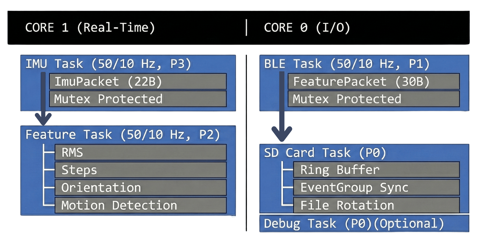
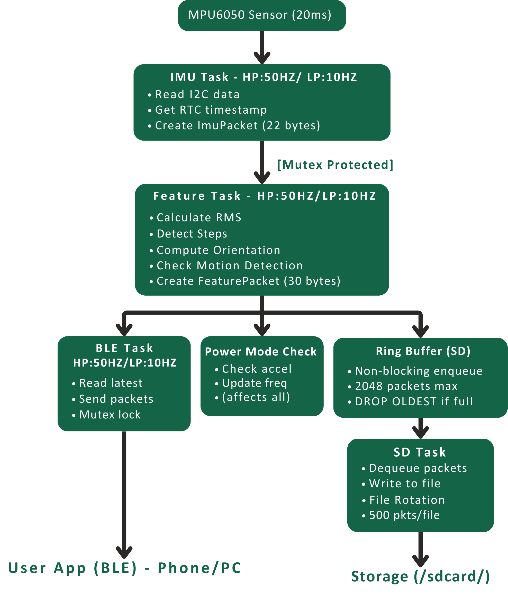

# ESP32-S3 Real-Time IMU + BLE + SD Card Logging System

A concurrent embedded system for motion data acquisition with 50 Hz IMU sampling, wireless BLE streaming, buffered SD logging, and adaptive power management running on dual-core FreeRTOS.

**Key Features**: High-frequency sensor fusion, real-time signal processing, wireless telemetry, persistent storage, power optimization

**📹 Demo**: [Watch on YouTube](https://youtu.be/0sC028-XWAc)

---

## Quick Overview

- **5 FreeRTOS Tasks** (dual-core: Core 1 real-time, Core 0 I/O)
- **50 Hz IMU sampling** with < 150 µs jitter
- **Real-time features**: RMS, step detection, orientation tracking
- **BLE streaming**: 50 Hz (normal) / 10 Hz (low-power)
- **SD card logging**: Ring buffer (2048 packets, 40 sec @ 50 Hz)
- **Power saving**: Motion detection with reduced sample rates in low-power mode
- **Unit tests**: Pending (framework ready, test cases in development)

---

## Table of Contents
1. [System Overview](#system-overview)
2. [Core Features](#core-features)
3. [Task Architecture](#task-architecture)
4. [Configuration](#configuration)
5. [Getting Started](#getting-started)

---

## System Overview

### Architecture



### Workflow



**Data Flow Architecture**:
- **BLE (HP:50Hz / LP:10Hz)**: Reads **latest FeaturePacket directly** via mutex (no buffering, always current)
- **SD**: Uses **ring buffer** for reliable queuing (2048 packet buffer, DROP_OLDEST policy)
- **Feature task**: Writes to both paths simultaneously (mutex for BLE, non-blocking enqueue for SD)
- **Power Mode**: HP (High Power) 50 Hz normal / LP (Low Power) 10 Hz - affects IMU, Feature, and BLE sampling rates dynamically

**Backpressure Flow**:
- Feature task **non-blocking enqueue**: Never stalls, uses zero-wait semaphore
- If ring buffer full (2048 packets): **DROP_OLDEST** policy discards newest incoming
- SD task **non-blocking dequeue**: Pulls packets asynchronously at I/O speed
- When SD offline: Ring buffer holds ~40 sec of data, new packets queued normally
- When SD recovers: Flushes buffered packets, no data loss


---

## Core Features

### 1. RMS (Root Mean Square) - Signal Magnitude

25-sample sliding window (0.5 sec @ 50 Hz) calculates acceleration magnitude squared sum, then computes RMS.

**Ranges**: Idle (~13K LSB) → Walking (~18K) → Running (~35K LSB)  
**Implementation**: Accumulates `ax² + ay² + az²` over 25 samples, then computes `sqrt(sum/25)`  
**Scaling**: Stored as `int16_t rms` (RMS * 100 for fixed-point precision)

```cpp
accSqSum += (int32_t)ax*ax + ay*ay + az*az;
if (rmsCount >= 25) {
    rmsValue = sqrt((float)accSqSum / 25);
    accSqSum = 0;
    rmsCount = 0;
}
```

### 2. Step Detection - 3-Point Peak Algorithm with Low-Pass Gravity Filter

Detects peaks in dynamic (linear) acceleration by filtering out gravity component:
1. **Gravity estimation**: Low-pass filter on raw acceleration (α=0.98) to extract gravity
2. **Dynamic acceleration**: Remove gravity from raw data
3. **Peak detection**: 3-point local maximum detection with 250ms minimum interval

```cpp
// Low-pass filter to estimate gravity (slowly adapts)
gravityX = 0.98 * gravityX + 0.02 * ax;

// Remove gravity to get dynamic acceleration
dynX = ax - gravityX;
dynMagSq = dynX² + dynY² + dynZ²;

// 3-point peak: prev < current > next AND current > threshold
if (prevMag < currentMag && currentMag > nextMag && 
    currentMag > THRESHOLD && (now - lastStep) >= 250ms) {
    stepCount++;
}
```

**Threshold**: 10000 LSB²  
**Accuracy**: ~95% for normal walking patterns  
**Output**: 32-bit step counter (persistent across power cycles)

### 3. Orientation Tracking - Complementary Filter with Gravity-Adaptive Pitch/Roll

Fuses gyroscope (fast, drifts) with accelerometer (stable, noisy) using 80/20 complementary filter:
- **Gyroscope Integration**: Measures rotation rate in °/s (±500°/s range, 65.5 LSB/°/s)
- **Accelerometer Reference**: Calculates pitch/roll from gravity vector
- **Complementary Blend**: 80% gyro (short-term accuracy) + 20% accel (long-term stability)

```cpp
// Gyro integration (20ms cycle)
gyroPitch = pitch + (gx/65.5) * 0.02;
gyroRoll = roll - (gy/65.5) * 0.02;

// Accel reference (gravity vector)
accelPitch = atan2(ay, sqrt(ax² + az²)) * 180/π;
accelRoll = atan2(-ax, az) * 180/π;

// Complementary: 80% gyro, 20% accel
pitch = 0.80 * gyroPitch + 0.20 * accelPitch;
roll = 0.80 * gyroRoll + 0.20 * accelRoll;
```

**Output Range**: ±90° (pitch), ±180° (roll)  
**Precision**: 0.01° (stored as int16_t * 100)  
**Sensor Config**: ±4g accel (8192 LSB/g for improved step detection)

### 4. Motion Detection & Power Management

Calculates acceleration magnitude; if below 20K LSB for 5 seconds → enters low-power mode.

**Algorithm**:
- Continuously compute `accel_mag = sqrt(ax² + ay² + az²)`
- If `accel_mag > 20000 LSB`: Update motion timestamp, stay in Normal mode
- If `accel_mag ≤ 20000 LSB` for > 5 seconds: Switch to Low-Power mode

```cpp
accel_mag = sqrt(ax² + ay² + az²);
if (accel_mag > 20000) {
    lastMotionTime = now;
    isLowPowerMode = false;
} else if ((now - lastMotionTime) > 5000ms) {
    isLowPowerMode = true;
}
```

**Threshold**: 20000 LSB (5K margin above idle ~13K-15K)  
**Inactivity Timer**: 5000 milliseconds  
**Current Implementation**: IMU/Feature task rates adjust dynamically based on `isLowPowerMode` flag

### 5. BLE Wireless Streaming

**Protocol**: NimBLE 5.0, 30-byte FeaturePacket notifications  
**Update Rate**: 50 Hz (normal) / 10 Hz (low-power mode)  
**Data per packet**: Index, timestamp, accel/gyro XYZ (raw), RMS, pitch, roll, step count  
**Bandwidth**: 1.2 KB/sec (normal mode)

**Packet Format** (30 bytes total):
```
struct FeaturePacket {
  uint32_t sampleIndex;    // Monotonic packet index
  uint32_t timestamp;      // Unix seconds (RTC)
  int16_t ax, ay, az;      // Accelerometer (raw LSB)
  int16_t gx, gy, gz;      // Gyroscope (raw LSB)
  int16_t rms;             // RMS * 100 (fixed-point)
  int16_t pitch;           // degrees * 100
  int16_t roll;            // degrees * 100
  uint32_t stepCount;      // Total steps
};
```


### 6. SD Card Logging - Ring Buffer with DROP_OLDEST Policy

**Buffer Structure**: Static circular buffer, 2048 packets (61 KB RAM) = ~40 seconds @ 50 Hz  
**Write Policy**: Asynchronous ring buffer with automatic DROP_OLDEST when full  
**File Rotation**: Every 500 packets (~10 sec @ 50 Hz) for manageable file sizes

**Ring Buffer Data Structure**:
```cpp
struct RingBuffer {
  FeaturePacket packets[2048];  // Circular array
  uint16_t write_head;          // Next write position (0-2047)
  uint16_t read_head;           // Next read position (0-2047)
  uint16_t count;               // Current packets stored (0-2048)
  uint32_t dropped;             // Cumulative dropped packets
  SemaphoreHandle_t mutex;      // Thread-safe access
};
```

**Enqueue Operation** (Feature Task → Buffer):
1. Feature task calls `sd_enqueue(&packet)` (non-blocking, 0 ms timeout)
2. Acquires mutex with zero-wait (`xSemaphoreTake(..., 0)`)—if locked, **skips enqueue** (no stalling)
3. If `count < 2048`: Places packet at `write_head`, increments `write_head = (write_head + 1) % 2048`
4. If `count == 2048` (buffer full): **DROP_OLDEST**—overwrites oldest packet at `read_head`, increments `dropped` counter
5. Releases mutex

**Dequeue Operation** (SD Task → Write to File):
1. SD task calls `sd_dequeue(&packet)` asynchronously (triggered by 500-packet batches)
2. Acquires mutex, reads packet at `read_head`, increments `read_head = (read_head + 1) % 2048`
3. Decrements `count`
4. Writes packet to SD file (30 bytes per packet)
5. Releases mutex

**Backpressure Handling**: 
- If ring buffer fills (count == 2048): DROP_OLDEST **discards oldest incoming packets**
- Dropped packet count tracked (`dropped` field) for diagnostics
- Feature task **never blocks**—enqueue always completes in microseconds

**Buffer Initialization**:
- Ring buffer **cleared on SD card initialization** (`sd_clearBuffer()`)
- If SD card present at startup: cleared immediately during `sd_init()`
- If SD card inserted later: cleared when `sd_init()` succeeds after insertion
- This ensures clean state for each SD session

**Reliability**: 
- Error recovery: Marks SD as "not ready" after 5 consecutive write failures
- Automatic retry: SD task retries initialization every 1 second if removed
- File storage: Unix-style paths (`/sdcard/imu_log_<timestamp>.bin`), binary format (30 bytes/packet)
- Each file contains exactly 500 sequential packets with no gaps
- Thread-safe: Mutex protects concurrent access (Feature task writes, SD task reads simultaneously)

---

## Task Architecture

| Task | Core | Priority | Rate | Stack | Purpose |
|------|------|----------|------|-------|---------|
| IMU | 1 | 3 | 50/10 Hz | 4 KB | Read sensor via I2C |
| Features | 1 | 2 | 50/10 Hz | 8 KB | Process RMS, steps, orientation, motion |
| BLE | 0 | 1 | 50/10 Hz | 4 KB | Send packets wirelessly |
| SD | 0 | 0 | Async | 8 KB | Batch write to SD |
| Debug | 0 | 0 | 1 Hz | 8 KB | Serial stats (optional) |

**Note**: Debug task is **optional** for production. To disable: comment out Debug task creation and `Serial.begin(115200)` in `setup()`. Core functionality remains unaffected.

**Synchronization**:
- **Mutexes** (2): Protect shared ImuPacket and FeaturePacket data structures with non-blocking access (`xSemaphoreTake(..., 0)` to prevent stalling)
- **Event Groups** (1): Track SD card readiness (SD_READY_BIT)
  - **Set** when `sd_init()` succeeds (SD ready for logging)
  - **Cleared** when SD card is removed or unavailable
  - **Current Implementation**: Created and managed by SD task, but not actively used by other tasks for blocking/waiting—other tasks check SD state via `sd_isReady()` or `sd_getStatus()` directly
  - **Design Intent**: Future enhancement to synchronize dependent tasks (e.g., pause logging if SD becomes unavailable)
- **Ring Buffer**: 2048-packet circular buffer for SD logging with DROP_OLDEST overflow policy

**Timing**: 20ms cycle (measured), <150µs jitter (measured via `esp_timer_get_time()`)

All settings in [include/config.h](include/config.h):

```cpp
// Task Timing
IMU_SAMPLE_RATE_HZ              50      // Hz
FEATURE_UPDATE_RATE_HZ          50      // Hz
BLE_NOTIFY_RATE_HZ              50      // Hz

// SD Card
MAX_PACKETS_PER_FILE           500      // packets per file
RING_BUFFER_SIZE              2048      // packets total

// Power Management
POWER_SAVE_ENABLE               1       // 1=enabled
MOTION_THRESHOLD            20000       // LSB (acceleration)
MOTION_INACTIVE_TIME_MS      5000       // milliseconds
LOW_POWER_IMU_RATE_HZ          10       // Hz (low-power mode)
LOW_POWER_BLE_RATE_HZ          10       // Hz (low-power mode)

// Sensor Calibration
ACCEL_SCALE_4G            8192.0        // LSB/g
GYRO_SCALE_500DPS          65.5         // LSB/°/s
COMPLEMENTARY_ALPHA         0.80        // Filter coefficient
```

### Tuning Guide

- **IMU_SAMPLE_RATE_HZ**: 50 Hz default (balance precision vs. power)
- **MOTION_THRESHOLD**: 20000 LSB (5K margin above idle ~13K)
- **RING_BUFFER_SIZE**: 2048 packets (40 sec @ 50 Hz, 61 KB RAM)
- **COMPLEMENTARY_ALPHA**: 0.80 (80% gyro, 20% accel)

---

## Reliability & Recovery

### Jitter Measurement
Timing jitter (< 150 µs) is measured using **`esp_timer` API** for microsecond precision:
- **`esp_timer_get_time()`**: Captures monotonic timestamps between consecutive IMU samples (at task cycle)
- **Per-cycle tracking**: Stores min/max actual period vs. expected 20ms (calculated between sample N and N+1)
- **Worst-case analysis**: Computes jitter deviation (±µs from 20ms target) every 1-second window
- **Error tracking**: Increments error counter on failed I2C reads; critical if ≥5 consecutive failures
- **Real-time display**: Debug output shows health metrics: jitter, IMU status, BLE connection, SD status

### SD Card Failure Management
- **Lazy Initialization**: SD initialization happens **inside the SD task** (lazy load), not in `setup()` to prevent system-wide blocking
- **Ring Buffer Protection**: All feature packets queued to ring buffer immediately; SD writes asynchronously
- **Non-blocking Enqueue**: `sd_enqueue()` uses `xSemaphoreTake(..., 0)` (no wait) to prevent task stalling
- **Removal Detection**: Periodic `sd_isReady()` checks during write; detects if card was removed
- **Error Recovery**: After failed write, system checks SD status and marks as "not ready" if needed
- **Automatic Retry**: SD task retries initialization every 1 second using `vTaskDelay()`
- **Graceful Degradation**: Ring buffer (2048 packets) holds data while SD is offline; no samples lost
- **Zero-Wait Writes**: All I/O operations non-blocking; task never stalls on SD I/O

### BLE Disconnection Management
- **Connection State Tracking**: Maintained via NimBLE server callbacks (`onConnect`/`onDisconnect`)
- **Automatic Reconnection**: On disconnect, device restarts advertising automatically
- **Buffered Data**: Feature packets queue to ring buffer regardless of BLE state
- **Graceful Degradation**: System continues sampling/logging if BLE client disconnects
- **Fast Reconnection**: Connection parameters optimized (12ms min interval, 60s timeout)
- **Continuous Notify**: Data sent @ 50 Hz when connected, seamless recovery when client reconnects

### Log Format
- **Monotonic sequencing**: Single global packet index (starts @ 0, never resets within file)
- **Per-packet timestamps**: RTC-based Unix seconds + milliseconds in each packet
- **Sequence verification**: CSV converter validates index continuity to detect packet loss
- **File rotation**: Automatic rotation every 500 packets (~10 sec @ 50 Hz) for manageable file sizes
- **Zero data loss**: Ring buffer (2048 packets) prevents data loss during SD issues

---

## Hardware Configuration

| Component | Connection | Notes |
|-----------|-----------|-------|
| **MPU6050 IMU** | Wire1 (I2C1) | SDA=39, SCL=38, 400 kHz |
| **DS3231 RTC** | Wire (I2C0) | SDA=9, SCL=8, 400 kHz |
| **SD Card (SPI)** | SDMMC | MMC1 (default pin) |
| **UART Debug** | USB | 115200 baud |

---

## Getting Started

### Build Firmware
```bash
pio run
```

### Upload to Device
```bash
pio run -t upload
```

### Monitor Real-Time Output
```bash
pio device monitor -b 115200
```

Example output:
```
[12:34:56] Index=250 RMS=14200 Pitch:12.5° Roll:6.3° Steps=18 Mode=NORMAL
[12:34:57] Index=270 RMS=13800 Pitch:0.2° Roll:0.1° Steps=18 Mode=POWER-SAVE
[POWER] Entering low-power mode (inactive for 5234 ms)
[SD] Packets Written:1250 Dropped:0 Ring: Enq:1250 Deq:1250
```

### Extract & Convert SD Logs

1. Copy all `.bin` files from the SD card to the `bin_to_csv/bin_files/` folder (already exists in repo)
2. Run the conversion script inside 'bin_to_csv' folder
```bash
python bin_to_csv.py
# Reads all .bin files from bin_files/ folder
# Generates CSV files in csv_files/ folder with timestamps, sensor values, computed features
```

---

## Summary

| Aspect | Details |
|--------|---------|
| **Sampling** | 50 Hz IMU (< 150 µs jitter) |
| **Features** | RMS, steps, orientation (complementary filter) |
| **Wireless** | BLE 5.0, 30B packets @ 50/2 Hz |
| **Storage** | SD ring buffer (2048 packets), 500 per file |
| **Power** | Adaptive mode switching with motion detection |
| **Platform** | ESP32-S3 dual-core FreeRTOS |